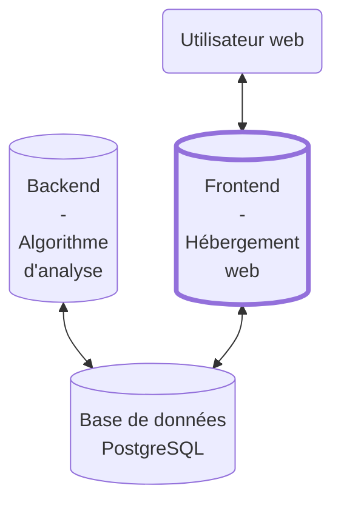

# Sources Hugo Décrypte - frontend 

---

:x: **CE PROJET N'EST PLUS ACTIF PAR MANQUE DE TEMPS ET DE VISIBILITE. LE CODE SOURCE RESTE TOUTEFOIS DISPONIBLE.** :x:

**UNE ARCHIVE DU SITE WEB EST DISPONIBLE A L'ADRESSE SUIVANTE:** [sourceshugodecrypte.netlify.app](https://sourceshugodecrypte.netlify.app)

---

Ce répertoire contient le code source de la partie web du projet "Sources Hugo Décrypte".

Le rôle de cette partie est :
- de lire les informations stockées dans la base de données
- de réaliser des statistiques sur ces données
- de les présenter sur le site web [sourceshugodecrypte.fr](https://sourceshugodecrypte.fr)

Sur ce site, nous affichons des statistiques sur les sources utilisées par Hugo Décrypte en nous efforçant d'être le plus impartial possible. Nous laissons libre à chacun de conclure sur les résultats mis en avant.

La partie frontend est donc l'intermédiaire entre la base de données et l'utilisateur, comme présenté sur le schéma suivant :

Le code source présent ici est synchronisé avec Netlify, qui assure le déploiement du site web.

Pour en savoir plus sur la partie backend : [Sources Hugo Décrypte - backend](https://github.com/Sources-Hugo-Decrypte/sources-hugo-decrypte-backend#readme)

Le projet étant toujours en cours, nous travaillons actuellement sur l'intégration de nouvelles fonctionnalités. N'hésitez pas à nous remonter toute proposition que vous pourriez avoir ! 😉
